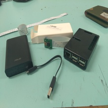
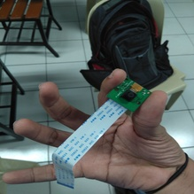
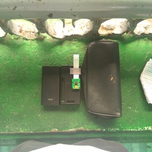
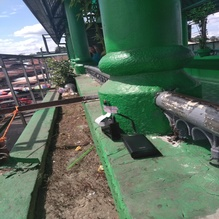
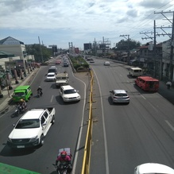
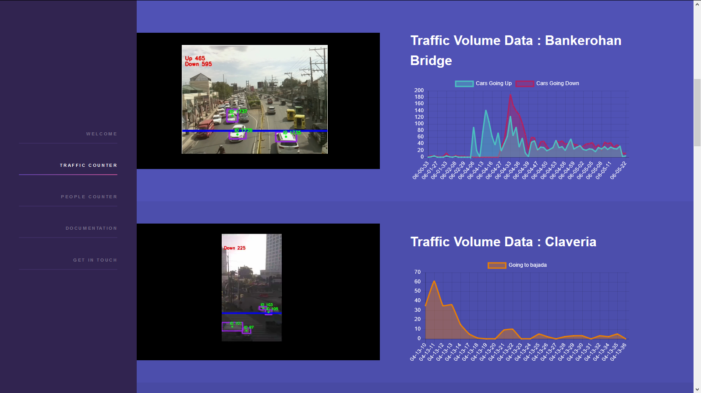

# Traffic Counter

A vehicle counting system developed with OpenCV and Flask

Implemented on Raspberry Pi 3B+ motherboard

## Hardware

| Components                                           |                        Camera                         |
| ---------------------------------------------------- | :---------------------------------------------------: |
|    |         |
| Components Combined                                  |                 Data Collection Setup                 |
|  |  |
| Occular A                                            |                       Occular B                       |
|       |        |

## Software

